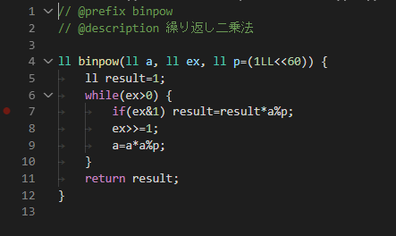

## コーディング用
### C/C++
https://marketplace.visualstudio.com/items?itemName=ms-vscode.cpptools

Microsoft 公式の拡張機能．C/C++ のコードを書くときの入力補完や構文の色付けをしてくれる．

ぶっちゃけ入れなくてもコーディングはできるけど，単純に画面が見づらいので入れておいて損はない．

VSCode からは [C++ Intellisense](https://marketplace.visualstudio.com/items?itemName=austin.code-gnu-global) という拡張機能も薦められるけど似た機能があるのかな？
入れたことないのでわかりません

### indent-rainbow
https://marketplace.visualstudio.com/items?itemName=oderwat.indent-rainbow

インデントに着色してくれる．
最も恩恵を受けるのはPythonistaたちだと思うが，その他の言語でも見やすくなるので導入しておきたい．

### Control Snippets（disabled）
https://marketplace.visualstudio.com/items?itemName=svipas.control-snippets

様々な拡張機能にくっついてくるスニペットの表示/非表示を切り替えることができるようになる．

自作スニペットが埋もれたりすることがあったので導入．
効果はよくわからなかった...（たぶんちゃんと検証すれば非表示になってるはず）

## ライブラリ作成用
### easy-snippet
https://marketplace.visualstudio.com/items?itemName=inu1255.easy-snippet

スニペットの新規作成，編集，削除が簡単にできる．

アクティビティバーから言語別スニペットの一覧を確認でき，+ボタンでスニペットの新規作成，既存のスニペットを選択で編集ができる．

jsonを編集するのではなく，コードをそのままコピペするだけで編集できる．

（言語に依らない）グローバル定義やワークスペースごとの定義には対応してないみたいなので，その場合は[VSCodeスニペット用コード作成ツール](https://migi.me/vsc_snippet/)を使っている．

[Snippet Generator](https://marketplace.visualstudio.com/items?itemName=fiore57.snippet-generator) という拡張機能もあり，こちらはコピーしたコードを右クリックメニューからスニペットに登録できる．
ただ，編集の勝手が easy-snippet のほうが数段上と感じた．

### Todo Tree（disabled）
https://marketplace.visualstudio.com/items?itemName=Gruntfuggly.todo-tree

ワークスペース内のファイルにあるメモをまとめて表示してくれる．

設定したキーワードをメモ文章の前に書くと，アクティビティバーからリストを見ることができる．

設定の幅が広く，リストに表示する文章の構成を設定したり（ファイル名を入れるなど），複数のキーワードをグループ化して一つのキーワードとして扱ったり，ステータスバーにキーワードごとのメモの数を表示したり，自分好みにカスタマイズできる．

そこそこ便利だったが，カスタマイズの幅が広すぎて扱いきれなかったのと，Git で管理していたので GitHub の issue 使えばよさそうだな～となって Disable とした．

## (bonus) 競プロ関係なく使ってるもの
### vscode-pdf
https://marketplace.visualstudio.com/items?itemName=tomoki1207.pdf

VSCode 上で PDF を表示できるようになる．
入れておいて損はないと思う．

### VTools（disabled）
https://marketplace.visualstudio.com/items?itemName=venryx.vscode-vtools

エディタにフォーカスを移したときにアクティビティバーやターミナルなどを折りたたんでくれる．

ノートPCだと画面が小さく，エディタの表示領域が狭くなりがちなので，コードや文章を書くときに折りたたんでくれると捗る．

### Clock in status bar（disabled）
https://marketplace.visualstudio.com/items?itemName=Compulim.vscode-clock

ステータスバーに時計を表示してくれる．

前述の理由からウィンドウ表示領域を広げるためにタスクバーを隠しているので，通常時は時計が隠れて見えなくなっている．
これがあると常に時刻を確認できるので便利．

また，時計を表示している場所をクリックするとタイムスタンプを挿入してくれるので一石二鳥．

ノートPCを買い替えて14インチ，FHDになったのでタスクバーを常時表示していても特に気にならなくなったので Disable．今までありがとう...
