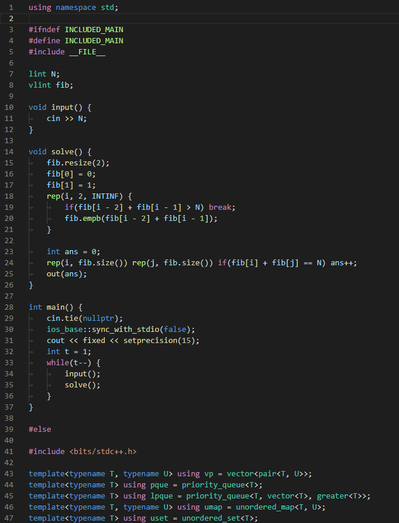

## はじめに
この記事は以下の記事の内容を前提に執筆しています．

[これで効率爆上がり！C/C++の競プロ用テンプレートをmain関数の下に追いやる必殺技](https://qiita.com/Raclamusi/items/660f0f42c57e4371ed78)

## 環境
- VSCode v1.54.3
- cpptools (C/C++ 拡張機能パック) v1.2.2

## 問題発生
自分の環境では，シンタックスハイライトがうまく動いてないようなので解決（してない）までの道のりを残します．

## 闘いの記録
### その1　インクルード時に怒られる

2行目で自身をインクルードしていますが，「`#include`ファイル`"C:\Users\takine\Private\kyopro\main.cpp"`にそれ自体が含まれています」と怒られました．

どうやら現在の VSCode では`__INCLUDE_LEVEL__`によるプリプロセッサ分岐の認識がうまくできないようなので，古来から伝わるインクルードガード方式に変えてみるとエラーが消えてくれます．

### その2　ハイライトが中途半端

エラーが消えたのでコーディング自体はできなくはないのですが，コードの一部に色が付いていません．速度が命の競プロerにとって，シンタックスハイライトによる可読性の向上は重要です．

一方で，`#else`以下のテンプレート部は問題なく着色されています．挙動がよくわかりません．

わけもわからずコードを色々といじっていると，1行目にインクルードガード以外のテキストを置いているとハイライトが効くことに気づきました．
`using namespace std;`のみ1行目に入れてみると，下図のようになります．

と思ったら今度はテンプレートの一部の色が消えました（？？？）

この意味不明な挙動になすすべもなく......

## 結局
謎の挙動の原因はわかりませんでした！
いかがでしたか？

正常にハイライトされない問題の他にも，補完やハイライトが効くまでの時間に無視できないほどのラグが生じてしまったりと，
正直デメリットの方が多いように感じます．
マウスホイールを高速に回す訓練を積んだ方が早いかもしれません．
